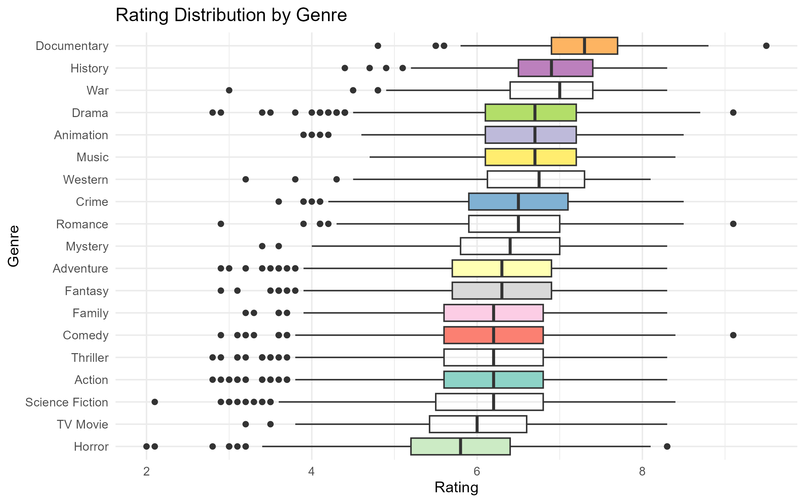
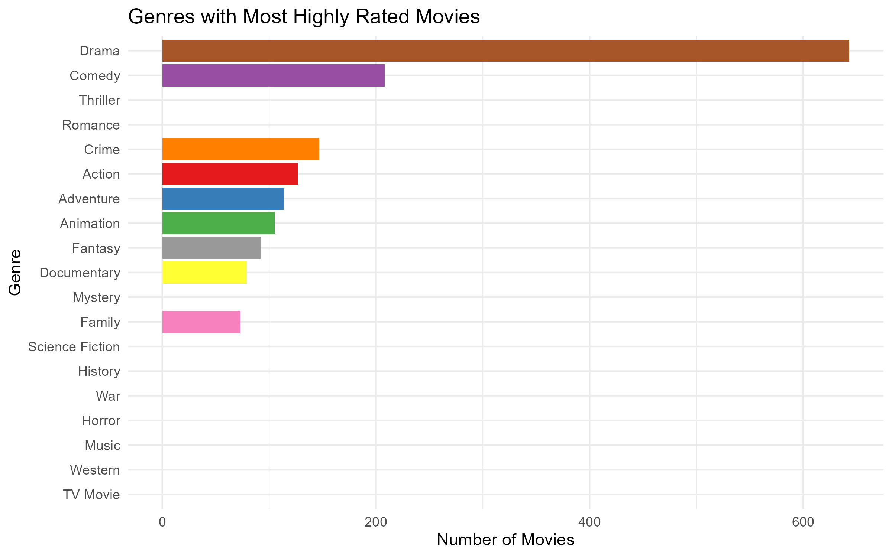
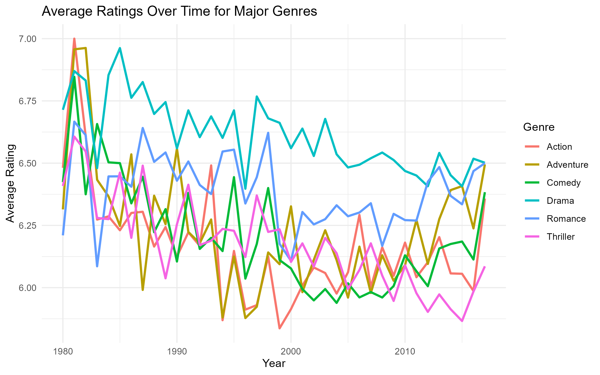

# Which Movie Genres Perform Best?
### A Data Driven Analysis of Audience Ratings

This project analyzes how movie ratings differ across genres using the Kaggle Movies Dataset. It compares average ratings, variation, and highly rated films to identify patterns in audience reception and explore how ratings for major genres have changed over time.

---

## Project Overview

Movies are produced across many genres such as action, drama, comedy, and science fiction, and audiences often have different expectations for each type. This project explores whether certain genres consistently receive higher ratings and how genre influences audience perception.

---

## Research Questions

Which movie genres receive the highest average ratings  
Do some genres show greater variation in ratings than others  
Which genres appear most frequently among highly rated films  
How have ratings for major genres changed over time  

---

## Dataset

The dataset used in this project comes from Kaggle

The Movies Dataset  
https://www.kaggle.com/datasets/rounakbanik/the-movies-dataset  

Main file used  
`movies_metadata.csv`

Key variables  
`genres` movie genre categories  
`vote_average` average user rating  
`vote_count` number of votes  
`release_date` movie release date  

---

## Data Cleaning

The dataset was cleaned and prepared before analysis

Removed movies with missing ratings or genre data  
Filtered out movies with fewer than 50 votes  
Converted the genre column from JSON format into readable values  
Extracted release year from the release date  

---

## Analysis and Visualizations

### 1. Average Rating by Genre  

This chart compares the average rating across genres to identify which types of movies tend to perform best

Insight Genres such as drama and documentary tend to receive higher average ratings, suggesting stronger audience reception

---

### 2. Rating Distribution by Genre  

A boxplot is used to examine how ratings vary within each genre

Insight Some genres like action and comedy show wider variation, meaning audience reactions are more mixed

---

### 3. Highly Rated Movies by Genre  

This analysis focuses on movies with ratings of 7.5 or higher

Insight Certain genres appear more frequently among highly rated films, indicating consistent strong performance

---

### 4. Ratings Over Time  

A time series plot shows how average ratings for major genres have changed since 1980

Insight Ratings remain relatively stable over time though some genres show slight trends reflecting changes in audience preferences

---

## Tools Used

R  
tidyverse  
ggplot2  
jsonlite  

---

## Repository Contents

`movie_analysis.R` full analysis code  
`movies_metadata.csv` dataset used  
`graphs` exported visualizations  

---

## Conclusion

The analysis shows that movie genre plays a meaningful role in audience reception. Some genres consistently receive higher ratings while others show greater variability. Over time audience preferences remain relatively stable but still show gradual changes across genres.

---

## How to Reproduce

Download the dataset from Kaggle  
Place `movies_metadata.csv` in your working directory  
Run `movie_analysis.R` in RStudio  
